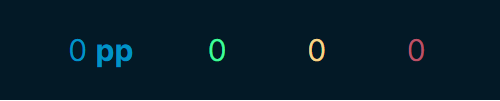

# tilda's pp counter
Custom PP counter made using gosumemory

# Using
Same as any other counter, just put the folder in `static`, inside your gosumemory install.

# Customizing
Refer to the css file in the `css` directory for more information on customization. Should be relatively easy.

# License
Apache 2.0
